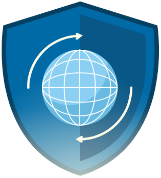
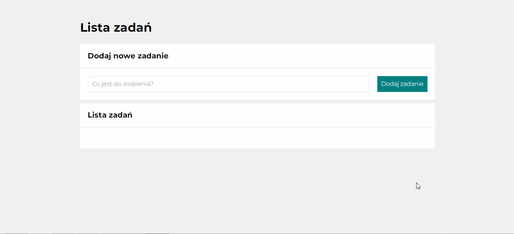
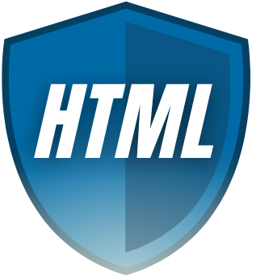
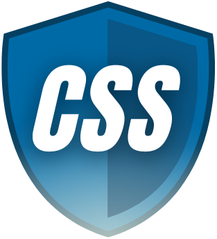
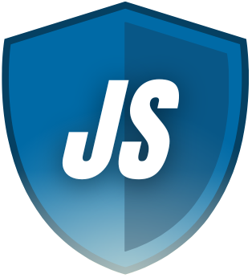
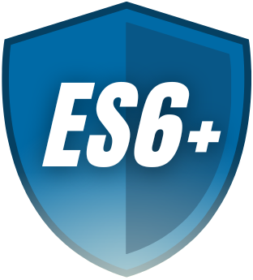
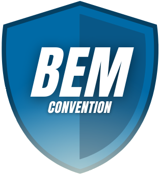
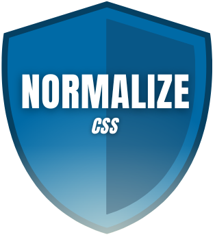

#  Task List Website 

 Made by Klaudia Kępka

##  Task List Demo Website:
[Task List Demo Website](https://kepkaklaudia.github.io/taskList-react/)

##  Quick Preview

## Add new task field
On the page you can find the input field to add your task

## Add new task button
On the right side of the input field you can find a button in teal color which is used to add tasks to the list.

After clicking it, the cursor will automatically focus on the input field to enter a new task.

## List of Tasks
After added new task it will be written below in the List of Tasks.

On the left side of the task you will see a green square - it is a marker that allows you to mark whether the task has been completed. When you click it, a check mark will appear in the square and the text will be crossed out. When you click it again, both the strikethrough and the check mark will disappear.

On the right of the task, you'll see a red square with a trash can icon. After clicking it, the corresponding task will be deleted.

## Responsive version
When you are in mobile/tablet mode (maximum width of screen: 550px) you can notice some changes.

The input field outline illumination changes from black to orange. In addition, both the input field and the button take up the entire available width.

# Getting Started with Create React App

This project was bootstrapped with [Create React App](https://github.com/facebook/create-react-app).

## Available Scripts

In the project directory, you can run:

### `npm start`

Runs the app in the development mode.\
Open [http://localhost:3000](http://localhost:3000) to view it in your browser.

The page will reload when you make changes.\
You may also see any lint errors in the console.

### `npm test`

Launches the test runner in the interactive watch mode.\
See the section about [running tests](https://facebook.github.io/create-react-app/docs/running-tests) for more information.

### `npm run build`

Builds the app for production to the `build` folder.\
It correctly bundles React in production mode and optimizes the build for the best performance.

The build is minified and the filenames include the hashes.\
Your app is ready to be deployed!

See the section about [deployment](https://facebook.github.io/create-react-app/docs/deployment) for more information.

### `npm run eject`

**Note: this is a one-way operation. Once you `eject`, you can't go back!**

If you aren't satisfied with the build tool and configuration choices, you can `eject` at any time. This command will remove the single build dependency from your project.

Instead, it will copy all the configuration files and the transitive dependencies (webpack, Babel, ESLint, etc) right into your project so you have full control over them. All of the commands except `eject` will still work, but they will point to the copied scripts so you can tweak them. At this point you're on your own.

You don't have to ever use `eject`. The curated feature set is suitable for small and middle deployments, and you shouldn't feel obligated to use this feature. However we understand that this tool wouldn't be useful if you couldn't customize it when you are ready for it.

## Technologies used
    
   